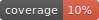
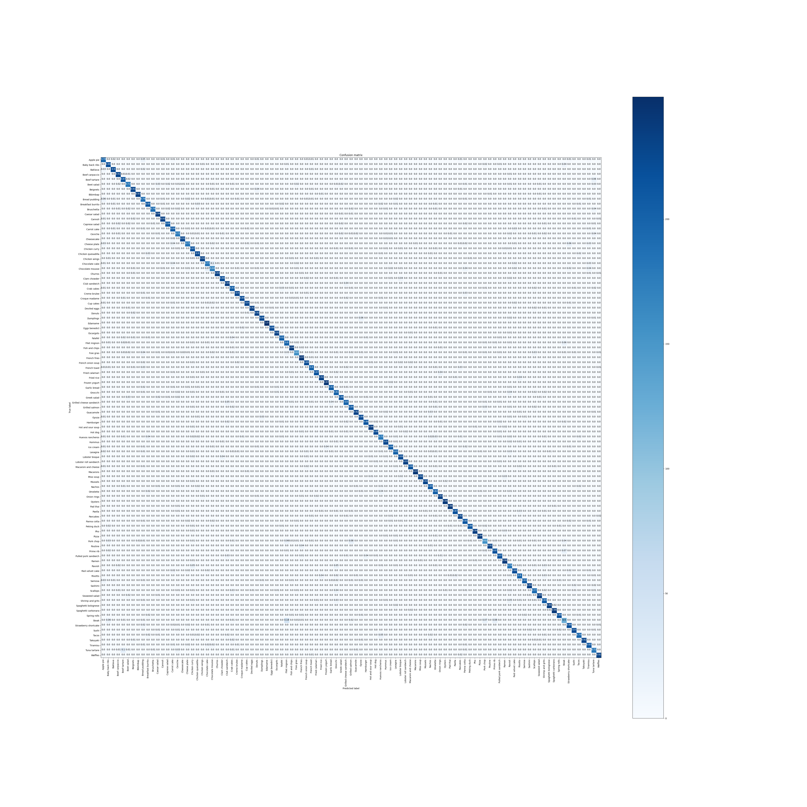

#  Food classification

Personal project for image classification on Food-101 dataset.  
This project has 2 goals :
- Optimize training time with TF Profiler -> DONE. I divided by 3 training times.
- Get best performance on Food-101 dataset using transfer learning and fine-tuning techniques based on papers in references.txt. -> DONE.
- Optimize model to put on mobile device with quantization techniques. -> DONE
- Intelligibility of the decisions taken by the algorithm. -> TODO.

# Setup 

Create a virtual environment and install librairies in `requirements.txt`.  
Download food-data on [Kaggle website](https://www.kaggle.com/dansbecker/food-101).   
After downloading the data, create a `data` folder at the root of the project organized as follows :  
|-data
    |-food-101
        |-test_directory
        |-train-directory
With the function `create_train_test_folder` in `src/tools/dataset.py` you will fill the `test_directory` and `train_directory` with the images from the train and test sets. This split is indicated in the files `train.json` and `test.json` in the `meta` folder of dataset downloaded. See docstring of the function to have more details.  

For the paths setup, create your own folder `src/settings/` copying an existing folder like qbox and change the path accordingly.
Then in the `src/settings/settings.py` change the variable ENV with the name of the folder you just created.
See the settings part in the next section for more information.

# Project organization

## Overview

- `src` contains all the code for the project.
- `tests` contains all the tests for the project.
- `notebooks`: all the notebooks for implementing quickly. This folder is separated from `src` because it should not used for production.  

## `src` folder

### `src/application`

All the files to launch the application like the training or the prediction. These files call other files defined in other folders. This folder is here to centralized the different entry points of the project.  

- `src/application/train_local.py` is an entry point for the project. You specify the tracking URI and the experiment name for MLflow. The experiment name is also used in the `src/pipelines/mlflow_train_pipeline.py` file to choose the right model.
- `src/application/predict_from_served_model.py` can call a model served with MLflow format locally or on Azure. The images need to be encoded in base 64 before being sent over HTTP. Then the images are stored in pandas DataFrame as required by MLflow. 

- `src/application/convert_to_tflite.py` to convert trained model to TF Lite.
- `src/application/convert_to_evaluate_tflite.py` to evaluate TF lite models.

### `src/classifiers`

All the models defined as classes :
- EfficientNetB0
- EfficientNetB4
- MobileNetV2
- Xception
These models are defined as classes for standardization purposes. They inherit from the KerasClassifier class that inherits from the Classifier class.

### `src/pipelines` 

The pipelines that organize the training :
- `src/pipelines/mlflow_train_pipeline.py` to train the models logging in MLflow and saving the models as MLflow format.
- `src/pipelines/train_pipeline.py` to train without MLflow for quick testing and debugging for example (not maintained).

### `src/settings`

This project uses a settings folder in [src/settings](../../src/settings/).  

The file `settings.py` defines all the variables that will be imported in the other files.
It has several purposes :
- To centralize the variables, dictionaries that can be imported in other files so that every file share the same values;
- To abstract the way these variables are defined either dictionaries or others;
- To hide the organization of the settings whatever the environment;
- To make import of settings simpler and elegant like importing modules in one line of code instead of loading each file containing variables in several lines of code in each file where the variables are needed.
  
Furthermore, it standardizes the logs. In this file you can define the levels of logs you need.  

The settings will load the variables that are common to all the environments. These variables are set in the folder `settings/common`. For example the models parameters.  
The settings will also load the variables according to the environment in which you work. To do so it defines the `ENV` variable which defines the folder where to find these variables. For example if you work locally on your computer you can create a folder `local-mac` and put all the paths to find the models or the datasets for example. 

### `src/tools`

All the utility files that are reused across the project.

## `tests` folder

- `tests/load_tests` : tests for the model served and the application;
- `tests/unit_tests` : is a replica of `src` containing all the unit test for the project in `src`;  
 not very well tested :(
- `tests/test_images`: images used for the tests.

# Problem presentation

Food-101 contains 101 classes of food among apple pie, edamame, chocolate mouse or chocolate cake. You can find all the 101 classes in the [classes](./src/tools/classes.txt) file.

Here is an excerpt of 5 photos for each class :  

There are :
- 75750 train images with each class containing 750 images
- 25251 test images with each class containing 250 images

# Benchmark

https://paperswithcode.com/sota/fine-grained-image-classification-on-food-101
https://github.com/stratospark/food-101-keras

# Results

Best result for EfficientNetB4 : *86.3%* of accuracy.  
  
Parameters used :  
- aug_factor	1  
- augment	True  
- batch_size	4  
- dataset	food-101/  
- fine_tuning	True  
- fine_tuning_epochs	50  
- fine_tuning_lr	1e-05  
- img_height	380  
- img_n_channels	3  
- img_width	380  
- learning_rate	0.0001  
- n_epochs	50  
- resize	True  
- test_mode	0  
- transfer_learning	True  
- weights	efficientnetb4/best_model.h5  

## Best results

The best precision, recall, f1-score and accuracy are for the class Edamame with scores of 1, 0.996, 0.997 and 1. When we look at the Edamame pictures from the grid of images, we see that Edamame can be very differentiated due to their green vivid color and particular form. 

## Lowest results

Lowest precision is for Ravioli : 0.64  
Lowest recall, f1-score and accuracy is for Steak : 0.5 , 0.56, 0.5  

If we look at the confusion matrix for Steak we see that the classes with which it is mistaken are :
- Prime rib : 7% of the time
- Filet mignon 6% of the time
- Baby back ribs 4% of the time
- Pork chop 4% of the time  
This is understandable because this meal are all meat.  

# TFLite & Quantization

Finally we converted the best model using TensorFlow Lite with different quantization techniques.  

*EfficientNetB4*
- Accuracy for fp32 model lite 0.8428 at ~500ms inference for model size of 68M.  
- Accuracy for fp16 model lite 0.8429 at ~500ms inference for model size of 34M.  (https://www.tensorflow.org/lite/performance/post_training_float16_quant)
- Accuracy for int8 quantized model with fp32 input images at ~300ms inference for model size of 21M.
- Accuracy for int8 quantized model with int8  input images at ~300ms inference for model size of 21M. (https://www.tensorflow.org/lite/performance/post_training_integer_quant)

Ressources for quantization  
https://www.tensorflow.org/lite/performance/best_practices
https://blog.tensorflow.org/2020/03/higher-accuracy-on-vision-models-with-efficientnet-lite.html
https://leimao.github.io/article/Neural-Networks-Quantization/
https://pytorch.org/docs/stable/quantization.html
https://www.tensorflow.org/lite/performance/model_optimization
https://jackwish.net/2019/neural-network-quantization-introduction.html
